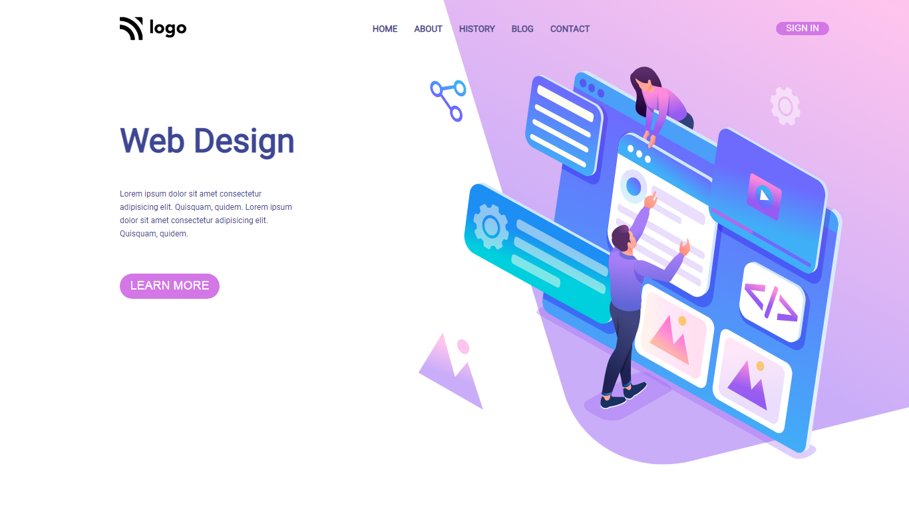

# Project 8 - Web Design Landing Page

  

 

[DEPLOYED WEBSITE LINK](https://fsbproject8.netlify.app/)

## What I learned from this Project?

- I learned about **positions** in css (relative, absolute).
- I also learned divs alignment.
- Images alignment using css.

## Completed the project in **2 hours**.